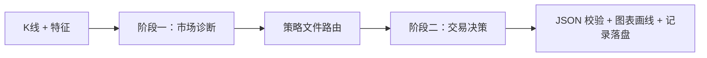

# Trading Agent 使用指南

> 本机部署路径：`E:\Dev\Trading\PA_Agent`  
> 项目仓库：[rosemarycox5334-debug/PA_Agent](https://github.com/rosemarycox5334-debug/PA_Agent)

---

## 一、项目是什么

**Trading Agent** 是一款运行在 Windows 上的 **价格行为（Price Action）AI K 线分析辅助工具**，面向主观交易者：

- 从 **MT5** 或 **TradingView** 读取 OHLCV K 线（**不是**截图识图）
- 本地计算 EMA20、ATR14、K 线几何特征
- 经大模型 **两阶段分析**：阶段一市场诊断 → 策略路由 → 阶段二交易决策
- 在图表上叠加入场/止损/止盈参考线，并完整落盘分析记录

**重要边界**：仅辅助分析，**不连接券商、不自动下单**。交易决策后果自负。

---

## 二、启动方式

任选其一：

| 方式 | 操作 |
|------|------|
| **推荐** | 双击项目根目录 `运行智能体.bat` |
| 命令行 | `cd E:\Dev\Trading\PA_Agent` 后执行 `python run.py` |
| 模块方式 | `python -m pa_agent.main` |
| 安装入口 | `pa-agent`（需已 `pip install -e .`） |

### 首次启动检查清单

1. **MetaTrader 5** 已打开并已登录（使用 MT5 数据源时）
2. 打开 **设置**，填写 AI 的 **Base URL**、**模型名**、**API Key**（见《配置指南》）
3. 控制栏选择 **数据来源**、**品种**、**周期**，确认图表有 K 线

---

## 三、主界面速览

```
┌──────────────────────────────────────────────────────────────────┐
│ [数据来源] [交易所] [品种] [周期]  ☑等待收盘  [提交分析][增量分析] │
├─────────────────────────────┬────────────────────────────────────┤
│   K 线图（蜡烛 + EMA20）     │  实时 │ 决策树 │ 决策 │ 原始 │ 调试  │
│   入场/止损/止盈线           │         AI 侧边栏                   │
└─────────────────────────────┴────────────────────────────────────┘
```

### 控制栏常用操作

| 控件 | 说明 |
|------|------|
| **数据来源** | `MT5`（默认，需 MT5 运行）或 `TradingView` |
| **品种** | 须与数据源一致，如 MT5 中 `XAUUSDm`（含后缀 `m`） |
| **周期** | 1m / 5m / 15m / 1h / 4h / 1d |
| **等待收盘** | 勾选后，提交分析前等待当前未收盘 K 走完 |
| **提交分析** | 完整两阶段 AI 分析 |
| **增量分析** | 基于上一轮成功记录，只分析新增已收盘 K 线 |
| **演示模式** | 回放已保存记录，不调用真实 API |
| **图表实时更新** | 分析中图表会冻结；点此恢复实时刷新 |

**K 线数量**在 **设置 → 通用** 中配置（默认 100 根，范围 2–5000）。

---

## 四、典型工作流

### 4.1 MT5 品种分析（最常见）

1. 打开并登录 **MT5**，在「市场报价」确认品种名（如 `US500m`）
2. 启动 Trading Agent，数据来源选 **MT5**
3. 输入与 MT5 **完全一致** 的品种名和周期
4. 等待图表填满 K 线后，点击 **提交分析**
5. 右侧 **实时** 标签查看流式输出；完成后在 **决策** 查看 JSON 与交易线
6. 需要继续提问时，在分析完成后使用 **追问**（使用与屏幕一致的 K 线表）

### 4.2 TradingView 数据源

1. 数据来源选 **TradingView**
2. 选择交易所（不确定时选 **（自动）**）
3. 点击 **获取数据** 开始拉取（TV 不会启动时自动拉取）
4. 若频繁超时：在设置中配置 TradingView 账号，或换更大周期测试

A 股示例：`600519` + `SSE`；港股：`HKEX` + 代码；也可用别名（如 `小米集团`），详见 `config/tv_symbol_aliases.example.json`。

### 4.3 增量分析

当同品种同周期已有**成功**分析记录，且新增已收盘 K 线 ≤ 设置中的「增量分析最大新增 K 线」（默认 10）时：

- 点 **提交分析** 会自动走增量模式；或
- 点 **增量分析** 强制增量（忽略阈值）

增量失败时改用完整 **提交分析**。

---

## 五、两阶段分析在做什么



- **阶段一**：周期结构、方向、闸门、逐 K 摘要（`bar_by_bar_summary`）
- **阶段二**：信号链、风险收益、下单方式（限价/突破/市价或不下单）
- **交易倾向**（设置中）：`conservative` / `balanced` / `aggressive` / `extreme_aggressive`

发给 AI 的是 **数值化 K 线表 + 特征表 + 提示词**，不是图表截图。

---

## 六、侧边栏标签说明

| 标签 | 用途 |
|------|------|
| **实时** | 分析过程流式输出、分析后追问 |
| **决策树** | 决策树文本与规则引用 |
| **可视化** | 决策树图形化（若启用） |
| **决策** | 结构化决策 JSON、入场/止损/止盈 |
| **原始** | 模型原始响应 |
| **调试** | Prompt、Token、校验信息等 |

---

## 七、图表说明

- **K1** = 最新**已收盘** K 线（发给 AI 的序列以此为准）
- 实时更新时，最右侧 **空心浅色 K** = 未收盘棒，不参与分析
- 提交分析后图表**冻结**为快照，未收盘棒会消失（与 AI 数据对齐）
- 分析完成后自动绘制：入场（白实线）、止损（红虚线）、止盈（绿虚线）

详见仓库 `docs/图表K线与分析快照说明.md`。

---

## 八、记录与日志

| 路径 | 内容 |
|------|------|
| `records/` | 分析记录（pending / 归档） |
| `logs/pa_agent.log` | 运行日志 |
| `experience/` | 经验库案例（供阶段二检索） |

可用 **演示模式** 回放历史记录，无需 API。

---

## 九、常见问题

| 现象 | 处理 |
|------|------|
| `ModuleNotFoundError: pa_agent` | 在项目根目录执行 `pip install -e .` |
| MT5 未连接 / 无 K 线 | 确认 MT5 已登录；品种名与「市场报价」完全一致 |
| 品种名红色警告 | 名称与 MT5 不匹配，对照报价窗口修改 |
| 数据不足 | 等待缓冲区填满或增大设置中的 K 线数量 |
| 分析时图表不刷新 | 正常；点 **图表实时更新** 恢复 |
| API 失败 | 检查网络、Base URL、模型名、Key；代理在系统层配置 |
| TradingView 超时 | 配置 TV 账号；修复 tvdatafeed headers（见《配置指南》）；换大周期 |
| 口头看涨但 JSON 做空 | 查看 `bar_by_bar_summary` 与校验结果；可调整验证严格度 |

更完整说明见仓库根目录 `PA_Agent使用文档.md`。

---

## 十、更新项目

```powershell
cd E:\Dev\Trading\PA_Agent
git pull
pip install -e . -i https://mirrors.aliyun.com/pypi/simple/ --trusted-host mirrors.aliyun.com
```

---

**免责声明**：本工具仅供学习与研究，不构成投资建议。
